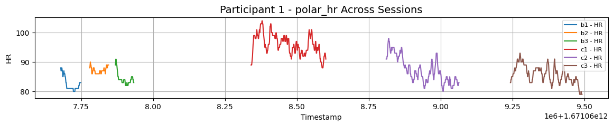
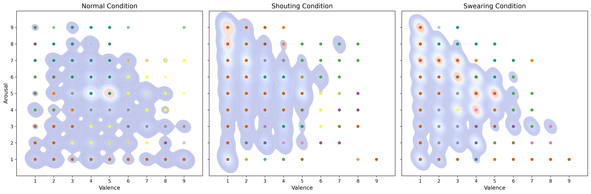
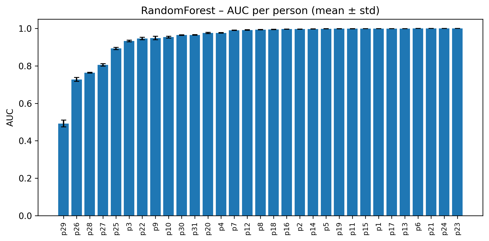

<br>

<p align="center">
  
</p>

<br>

<p align="center">
  <b>A Multimodal Dataset for Assessing <i>Emotion</i>, <i>Stress</i>, <br>and <i>Emotional Workload</i> in Interpersonal Work Scenario</b>
</p>

# 💻 EmoWork: Technical Validation Code
📌 This repository contains supplementary code and technical validation materials for the manuscript
> **"EmoWork: A Multimodal Dataset for Assessing Emotion, Stress, and Emotional Workload in Interpersonal Work Scenario"** (*under review*)

The dataset itself is available at [Zenodo - EmoWork](https://zenodo.org/uploads/15181220).
<br>

## 📁 Repository Structure

```
TECHNICAL_VALIDATION/
├── Dataset_Records.ipynb     # Data source summary and preprocessing overview
├── Label_Analysis.ipynb      # Label distribution, missing data, and correlation analysis
├── ML_analysis.ipynb         # Machine learning model implementation and evaluation
└── utils/                    # Utility scripts

RESULTS/
├── Condition/                # Session classification results (GT = session)
│   └── [model_name]/         # e.g., DecisionTree, RandomForest, ...
│       ├── all_runs_results.csv
│       └── summary_5runs.csv
├── Perceived/                # Label prediction results (GT = perceived_*)
│   └── [label_name]/         # e.g., perceived_arousal, perceived_stress, ...
│       └── [model_name]/     # e.g., XGBoost, SVM, ...
│           ├── all_runs_results.csv
│           └── summary_5runs.csv

EmoWork/                      # Directory to store the dataset files downloaded from Zenodo
├── META/                     # Metadata files
├── LABELS/                   # Ground-truth labels (e.g., perceived stress, arousal) 
├── SENSORS/                  # Multimodal sensor data

figures/
├── sensor_data/              # Visualizations from Dataset_Records.ipynb
├── label_analysis/           # Visualizations from Label_Analysis.ipynb
└── model_results/            # Visualizations from ML_analysis.ipynb

LICENSE
README.md
requirements.txt
```

## 🚀 Getting Started

We recommend using **Python 3.10**. Some dependencies may not be fully compatible with Python 3.11. All notebooks were developed and tested using Python 3.10.

1. Clone this repository
```bash
git clone https://github.com/Kaist-ICLab/EmoWork.git
```
2. Install dependencies:
```bash
pip install -r requirements.txt
```
3. Run the notebooks in **`TECHNICAL_VALIDATION`** folder:
- [`Dataset_Records.ipynb`](TECHNICAL_VALIDATION/Dataset_Records.ipynb)
- [`Label_Analysis.ipynb`](TECHNICAL_VALIDATION/Label_Analysis.ipynb)
- [`ML_analysis.ipynb`](TECHNICAL_VALIDATION/ML_analysis.ipynb)

## 📝 Notebook Overview

### `Dataset_Records.ipynb`
This notebook summarizes the dataset structure and provides a high-level overview of data sources and preprocessing steps. This notebook includes:
- Data collection protocol details
- Data quality checks
- Missing data analysis
- Data synchronization procedures

<p align="center">
  
  <br>
  <i>Example of heart rate signal collected from Polar H10</i>
</p>

Additional visualizations generated from this notebook are available in the [`figures/sensor_data/`](figures/sensor_data) directory.

### `Label_Analysis.ipynb`
This notebook analyzes the distribution of self-reported labels (e.g., perceived arousal, stress, suppression, valence), investigates missing values, and explores correlations and group differences (e.g., by gender or role).

<p align="center">
  
  <br>
  <i>Distribution of perceived arousal and valence across all participants</i>
</p>

Additional visualizations generated from this notebook are available in the [`figures/label_analysis/`](figures/label_analysis) directory.

### `ML_analysis.ipynb`
This notebook builds machine learning models to predict perceived emotional states 
(`arousal`, `stress`, `suppression`, `valence`) using five classifiers: 
**Decision Tree**, **Random Forest**, **SVM**, **XGBoost**, and **kNN**.

Model performance is evaluated with standard metrics including **Accuracy**, **F1 score**, **Precision**, **Recall**, and **ROC-AUC**.

<p align="center">
  
  <br>
  <i>Participant-wise AUC scores for session classification using a Random Forest model</i>
</p>

Additional visualizations generated from this notebook are available in the [`figures/model_results/`](figures/model_results) directory.

## 🤝 Contributing

We welcome contributions to improve the code and documentation. Please feel free to submit issues and pull requests.

## 📄 License

This project is licensed under the terms of the license included in the repository.